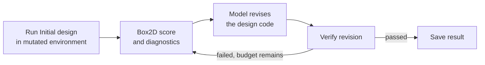

# PACE-Bench

**PACE-Bench: Benchmarking Physics Adaptation via Code Evolution in Dynamic Environments** evaluates whether a language-model agent can adapt an executable physical design after its environment changes.


## Why PACE-Bench?

Most physics benchmarks ask models to reason about or design for a fixed world. Real designs must also survive changes in friction, gravity, geometry, load, delay, or force limits. PACE-Bench tests this missing capability: infer what changed from simulator feedback, then revise the structure or controller until it works again.

## How it works

PACE-Bench contains 36 Box2D tasks across six physics domains. Each task has one `Initial` environment and four mutated stages. The provided Initial design passes `Initial` but fails each mutation, while a stage-specific reference confirms that every target remains solvable.

For an adaptation pair such as `Initial_to_Stage-1`, the benchmark runs the Initial design in the target environment as attempt 0, returns structured diagnostics, and asks the model to revise its Python design. Verification and revision repeat until success or budget exhaustion.



The repository ships one reproducible baseline, **vanilla Previous-One + Best**, and accepts external model providers and methods through dotted Python imports. The sections below focus on installing the benchmark, reproducing its protocol, and evaluating your own model or method.

## Benchmark at a glance

| Property | Count |
| --- | ---: |
| Physics categories | 6 |
| Base tasks | 36 |
| Environments per task | 5 |
| Total task environments | 180 |
| Initial-to-mutated pairs | 144 |

The task suite spans statics, kinematics, dynamics, granular/fluid interaction, control, and exotic physics.


## Installation

Python 3.10 is the reference version. `requirements.txt` is the only dependency file and includes the benchmark, Box2D runtime, OpenAI-compatible client, and local Transformers stack.

### Option A: Conda

```bash
git clone https://github.com/yuhao-zhan/PACE-Bench.git
cd PACE-Bench

conda create -n pace-bench python=3.10 -y
conda activate pace-bench
python -m pip install --upgrade pip
python -m pip install -r requirements.txt
```

### Option B: uv

Install [uv](https://docs.astral.sh/uv/), then run:

```bash
git clone https://github.com/yuhao-zhan/PACE-Bench.git
cd PACE-Bench

uv venv .venv --python 3.10
source .venv/bin/activate        # Windows: .venv\Scripts\activate
uv pip install -r requirements.txt
```

### Verify the installation

These commands use only the public benchmark interface:

```bash
pace-bench --help
pace-bench list --task S_01
pace-bench validate --task all --contracts-only

pace-bench evaluate \
  --task S_01 \
  --env Stage-1 \
  --method vanilla \
  --provider mock \
  --model mock \
  --attempts 1 \
  --output outputs/smoke \
  --no-resume
```

On a headless Linux worker, set:

```bash
export SDL_VIDEODRIVER=dummy
export SDL_AUDIODRIVER=dummy
export PYGAME_HIDE_SUPPORT_PROMPT=1
```

## Evaluate a model

### OpenAI or an OpenAI-compatible endpoint

```bash
export OPENAI_API_KEY=<your-key>

pace-bench evaluate \
  --task S_01 \
  --env Stage-1 \
  --method vanilla \
  --provider openai-compatible \
  --model <model-name> \
  --attempts 20 \
  --output outputs/my-run
```

For a compatible server, add `--base-url http://host:port/v1` or set `OPENAI_BASE_URL`.

### Local Hugging Face / Transformers model

```bash
pace-bench evaluate \
  --task K_03 \
  --env Stage-2 \
  --method vanilla \
  --provider local-transformers \
  --model /path/to/model \
  --device cuda:0 \
  --attempts 20
```

Use `--device mps` on supported Apple Silicon, `--device cpu` for CPU execution, or `--devices cuda:0,cuda:1 --workers 2` for deterministic per-device queues.

### Select tasks and environments

```bash
# One category, all four target stages
pace-bench evaluate --task category_3 --env all \
  --provider openai-compatible --model <model-name>

# Explicit task and environment selections
pace-bench evaluate --task S_01 --task K_01 \
  --env Stage-1 --env Stage-3 \
  --provider openai-compatible --model <model-name>

# Enumerate all 144 adaptation pairs without model calls
pace-bench evaluate --task all --env all \
  --provider mock --model mock --dry-run
```

Adaptation always uses Initial as the source. To generate a solution without a source reference, use from-scratch mode:

```bash
pace-bench evaluate --task D_01 --env Initial --from-scratch \
  --provider openai-compatible --model <model-name>
```

## Bring your own model or method

Research code can live outside this repository. Both extension points accept `package.module:Class` dotted imports. A minimal example is installed from [`src/custom_extension.py`](src/custom_extension.py):

```bash
pace-bench evaluate \
  --task S_01 --env Stage-1 \
  --provider custom_extension:CustomModel \
  --model my-model \
  --method custom_extension:CustomMethod \
  --attempts 2
```

A model provider implements:

```text
generate(GenerationRequest) -> GenerationResult
close()
```

A method implements:

```text
initialize(context)
build_initial_request()
build_revision_request(history)
observe(attempt)
finalize(result)
```

PACE-Bench retains ownership of task selection, attempt accounting, solver retries, Box2D verification, result serialization, and environment-pair identity.

## Validation and results

```bash
# List tasks and their environments
pace-bench list

# Validate module contracts and imports
pace-bench validate --task all --contracts-only

# Validate all reference-solution expectations for one task
pace-bench validate --task S_01

# Full 36-task reference validation; this is intentionally slow
pace-bench validate --task all

# Aggregate completed evaluation JSON
pace-bench report --input outputs/my-run
```

Results are stored under:

```text
outputs/<run>/<category>/<task>/<model>/<method>/run-<N>/Initial_to_Stage-<K>.json
```

Schema version `1.0` records task/pair identity, configuration, seeds, every request and candidate, task metrics, feedback, scores, errors, token usage, timing, and artifact paths. Completed results are resumed by default; pass `--no-resume` to rerun them.

For comparable reporting, keep the canonical task step limits and record the model revision, hardware, seed, attempt budget, number of runs, temperature, maximum tokens, and headless/display setting.

## Repository layout

```text
PACE-Bench/
├── src/
│   ├── custom_extension.py       # external model/method example
│   └── pace_bench/
│       ├── cli.py                # list, evaluate, validate, report
│       ├── evaluation/           # vanilla loop, prompts, providers, verifier, results
│       ├── tasks/
│       │   ├── registry.py       # task/env discovery and selection
│       │   ├── categories/       # 36 benchmark tasks
│       │   └── demos/            # 3 non-benchmark demos
│       ├── simulator.py
│       ├── renderer.py
│       └── primitives.py
├── assets/
├── requirements.txt
└── pyproject.toml                # minimal package and CLI installation metadata
```

Most source files belong to the benchmark tasks themselves. Each task intentionally keeps local modules for its design, environment, evaluator, diagnostics, prompt, renderer, and mutation stages; these encode task-specific physics rather than duplicated framework functionality.

## Scope and responsible use

PACE-Bench currently models 2D rigid-body systems in Box2D. It does not cover 3D dynamics, deformable bodies, full fluid simulation, perception, navigation, or multi-agent coordination. Task prompts and diagnostics are English-only.

Generated Python is executed by the benchmark verifier. Its static checks enforce benchmark rules but are not an operating-system security boundary. Run untrusted models in an isolated machine or container without credentials or sensitive mounts.

Contributions should preserve task physics, reference behavior, prompt exposure rules, deterministic seeds, simulation timing, attempt budgets, and canonical environment-pair identities. Experimental methods should remain in external packages rather than being added to the benchmark runtime.

PACE-Bench is released under the [MIT License](LICENSE).
