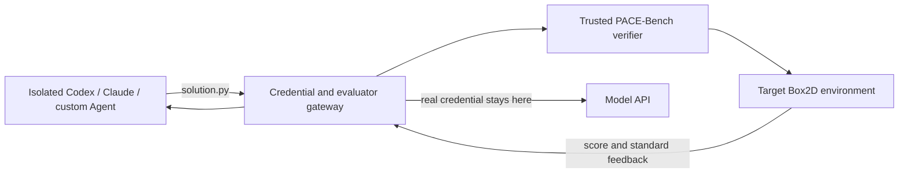

# PACE-Bench

**PACE-Bench: Benchmarking Physics Adaptation via Code Evolution in Dynamic Environments** evaluates whether a language-model agent can adapt an executable physical design after its environment changes.

<p align="center">
  
</p>

## Overview

PACE-Bench tests whether a language-model solver can adapt executable Python structures and controllers when the physical environment changes. A solver starts from an `Initial` solution, observes Box2D evaluation feedback in a mutated environment, and revises its code.

Each task contains one `Initial` environment and four mutated stages. Reference solutions verify that the source design fails each mutation while every target remains solvable. The benchmark supports API-hosted or local models, external methods, and black-box coding agents.

| Property | Count |
| --- | ---: |
| Physics categories | 6 |
| Benchmark tasks | 36 |
| Environments per task | 5 |
| Total environments | 180 |
| Initial-to-mutated pairs | 144 |

The categories are statics, kinematics, dynamics, granular/fluid interaction, control, and exotic physics.


## Repository layout

```text
PACE-Bench/
├── assets/                         # README figures
├── dataset_validation/             # dataset-construction audit prompts
├── src/
│   ├── custom_extension.py         # external provider/method example
│   └── pace_bench/
│       ├── cli.py                  # list, evaluate, agent, validate, report
│       ├── agents/                 # isolated coding-Agent runtime and gateway
│       ├── evaluation/             # evaluation engine, methods, providers, results
│       │   ├── prompt_data/        # shared demonstrations and framing
│       │   └── verification/       # safety checks and Box2D verification
│       ├── tasks/
│       │   ├── categories/
│       │   │   ├── Category1_Statics_Equilibrium/
│       │   │   ├── Category2_Kinematics_Linkages/
│       │   │   ├── Category3_Dynamics_Energy/
│       │   │   ├── Category4_Granular_FluidInteraction/
│       │   │   ├── Category5_Cybernetics_Control/
│       │   │   └── Category6_ExoticPhysics/
│       │   ├── demos/basic/        # tutorial demo; not benchmark data
│       │   ├── registry.py         # task discovery and selectors
│       │   └── stage_prompt.py     # mutation suffixes and variable inventories
│       ├── primitives.py           # task-facing physics helpers
│       ├── simulator.py            # shared Box2D stepping
│       ├── renderer.py             # shared pygame rendering
│       └── types.py                # task, attempt, and result records
├── requirements.txt                # dependency manifest
└── pyproject.toml                  # package and CLI metadata
```

Each category contains six self-contained `TASK_ID/` directories. Every task keeps its environment, evaluator, feedback, prompt, renderer, stage definitions, and reference solutions together; the detailed module contract appears in [Architecture notes](#architecture-notes).

## Installation

PACE-Bench targets Python 3.10 and is run from a cloned checkout. `requirements.txt` ends with `-e .`, which installs this checkout and registers `pace-bench`; no PyPI release is required.

### Conda

```bash
git clone https://github.com/yuhao-zhan/PACE-Bench.git
cd PACE-Bench
conda create -n pace-bench python=3.10 -y
conda activate pace-bench
python -m pip install --upgrade pip
python -m pip install -r requirements.txt
```

### uv

Install [uv](https://docs.astral.sh/uv/), then run:

```bash
git clone https://github.com/yuhao-zhan/PACE-Bench.git
cd PACE-Bench
uv venv .venv --python 3.10
source .venv/bin/activate        # Windows: .venv\Scripts\activate
uv pip install -r requirements.txt
```

### Verify

```bash
pace-bench --help
pace-bench list --task S_01
pace-bench validate --task all --contracts-only
pace-bench evaluate --task S_01 --env Stage-1 \
  --method vanilla --provider mock --model mock --attempts 1 \
  --output results/smoke --no-resume
```

For headless Linux:

```bash
export SDL_VIDEODRIVER=dummy
export SDL_AUDIODRIVER=dummy
export PYGAME_HIDE_SUPPORT_PROMPT=1
```

## Evaluate a model

| Provider | Use |
| --- | --- |
| `openai-compatible` | OpenAI API or any compatible HTTP endpoint |
| `local-transformers` | Local Hugging Face/Transformers model |
| `mock` | Deterministic tests and dry runs |
| `package.module:Class` | External provider |

### API-hosted model

```bash
export OPENAI_API_KEY=<your-key>
pace-bench evaluate --task S_01 --env Stage-1 \
  --method vanilla --provider openai-compatible --model <model-name> \
  --attempts 20 --runs 3 --output results/my-run
```

For another compatible server, add `--base-url http://host:port/v1` or set `OPENAI_BASE_URL`.

### Local model

```bash
pace-bench evaluate --task K_03 --env Stage-2 \
  --method vanilla --provider local-transformers --model /path/to/model \
  --device cuda:0 --attempts 20
```

Use `--device mps`, `--device cpu`, or `--devices cuda:0,cuda:1 --workers 2` as appropriate.

### Select work

```bash
# One category, all target stages
pace-bench evaluate --task category_3 --env all \
  --provider openai-compatible --model <model-name>

# Explicit tasks and stages
pace-bench evaluate --task S_01 --task K_01 \
  --env Stage-1 --env Stage-3 --provider openai-compatible --model <model-name>

# Enumerate all 144 pairs without model calls
pace-bench evaluate --task all --env all --provider mock --model mock --dry-run

# Solve Initial without a source reference
pace-bench evaluate --task D_01 --env Initial --from-scratch \
  --provider openai-compatible --model <model-name>
```

## Evaluate a coding agent as a black box

`pace-bench evaluate` controls revision prompts for a model; `pace-bench agent` lets a tool-using agent manage its own files, context, memory, and later prompts. Both receive the same initial adaptation request, few-shot demonstration, Initial reference, and attempt-0 feedback, and both use the same verifier, diagnostics, valid-submission budget, and result schema.

The trusted host keeps all task/environment source. The isolated Agent container receives only `AGENT_PROMPT.md`, `TASK.md`, `initial_solution.py`, editable `solution.py`, and the authenticated `pace-submit` client.



### Prerequisites and isolation

- Complete the normal installation, start Docker Desktop/Engine, and confirm `docker info` works.
- Use a dedicated API key; account-login files such as `~/.codex/auth.json` are not mounted.
- The Agent has a read-only root, one writable workspace, no repository/Docker-socket mount, dropped capabilities, resource limits, and an internal-only network.
- A gateway reaches only the selected model API and evaluator session; real keys remain in the gateway while the Agent sees placeholders.
- The built-in image pins Codex and Claude CLI versions; record overrides made with `--codex-version`, `--claude-version`, or `--rebuild-image`.

### Codex

```bash
export CODEX_API_KEY=<dedicated-openai-api-key>
pace-bench agent --task S_01 --env Stage-1 --agent codex \
  --model <codex-model> --attempts 20 --runs 2 --timeout-seconds 3600 \
  --output results/codex-s01
```

`OPENAI_API_KEY` is accepted as a fallback. Codex runs non-interactively with `codex exec --ephemeral`; project rules, MCP servers, and web search are not loaded.

### Claude Code

```bash
export ANTHROPIC_API_KEY=<dedicated-anthropic-api-key>
pace-bench agent --task K_03 --env Stage-2 --agent claude \
  --model <claude-model-or-alias> --attempts 20 --max-turns 200 \
  --timeout-seconds 3600 --output results/claude-k03
```

Claude runs in non-interactive print mode with telemetry, updates, `WebSearch`, and `WebFetch` disabled.

### Custom Agent

A custom image must run from `/workspace`, read `$PACE_AGENT_PROMPT_FILE` and `$PACE_AGENT_TASK_FILE`, write `solution.py`, call `$PACE_AGENT_SUBMIT solution.py`, and stop on success or exhausted budget. It must contain Python 3 for `pace-submit`.

```bash
docker build -t my-physics-agent:latest path/to/my-agent
pace-bench agent --task D_01 --env Stage-3 --agent custom \
  --image my-physics-agent:latest \
  --agent-command "my-agent --prompt {prompt_file}" \
  --model my-agent-model --attempts 20 --output results/my-agent
```

`--agent-command` is parsed as arguments and supports `{prompt_file}`, `{task_file}`, and `{workspace}`. A hosted custom Agent can use `--custom-base-url` and `--custom-api-key-env`; inside the container it reads `PACE_AGENT_API_BASE` and the placeholder `PACE_AGENT_API_KEY`.

### Prompts, submissions, and results

The default `AGENT_PROMPT.md` starts with the vanilla model's exact initial request, then adds only the Agent execution contract. Replace it with `--prompt-file my_agent_prompt.md` without changing benchmark feedback or scoring.

```bash
./pace-submit --status        # no budget consumed
./pace-submit solution.py     # verify one candidate
```

Malformed or structurally unusable submissions are rejected without consuming the valid-submission budget; valid code that fails construction, runtime, constraints, or physics consumes one attempt normally. Accepted submissions use the same compact trajectory schema as model runs. Use `--run-index` for another run or `--overwrite` intentionally.

The isolation path blocks ordinary Agent access to benchmark source, but it is not a general multi-tenant sandbox. Use a dedicated evaluator host without unrelated secrets, keep Docker patched, use short-lived keys, and never expose the evaluator port publicly.

## Bring your own model or method

External extensions use `package.module:Class`; see [`src/custom_extension.py`](src/custom_extension.py).

```bash
pace-bench evaluate --task S_01 --env Stage-1 \
  --provider custom_extension:CustomModel --model my-model \
  --method custom_extension:CustomMethod --attempts 2
```

A provider implements `generate(GenerationRequest) -> GenerationResult` and `close()`. A method implements `initialize(context)`, initial/revision request builders, `observe(attempt)`, and `finalize(result)`. PACE-Bench retains task selection, budgets, solver retries, verification, serialization, and environment-pair identity.

## Validation and results

```bash
pace-bench list                                      # tasks and environments
pace-bench validate --task all --contracts-only     # imports/contracts
pace-bench validate --task S_01                     # one reference matrix
pace-bench validate --task all                      # full 36-task validation
pace-bench report --input results/my-run             # aggregate JSON results
```

`--runs K` executes `K` complete trajectories for every selected task pair in model or Agent mode. Each trajectory receives the configured attempt budget (20 by default). Model-generation seeds deterministically combine the base `--seed`, run index, attempt index, and retry index, preserving independent legacy trial semantics. `--run-index` can select the first Agent run index. The CLI and `pace-bench report` calculate pair-level `Pass@1` through `Pass@K`, where `Pass@k` means that at least one of the pair's first `k` trajectories succeeds.

`--output` selects an experiment root. JSON is always saved; `--save-gif` additionally saves one GIF for every verified attempt, including adaptation attempt 0. The JSON and GIF trees intentionally mirror one another:

```text
results/<experiment>/
├── json/<task>/<model>/<method>/run-<N>/Initial_to_Stage-<K>.json
└── gif/<task>/<model>/<method>/run-<N>/Initial_to_Stage-<K>/
    ├── attempt-00.gif
    ├── attempt-01.gif
    └── ...
```

One schema `2.0` JSON represents one task-pair trajectory. It stores identity and run configuration; per-attempt code and hash, score, success, error category, failure reason, hard-constraint violations, step count, structural-break count, progress when available, token use, timing, and artifact references; and final success, best score/attempt, success attempt, stop reason, and trajectory error type. These are the signals used by the original score, code-similarity, budget, and error-taxonomy analyses. Full prompts, raw provider responses, formatted feedback, tracebacks, granular snapshots, body coordinates, stress arrays, and other high-volume physics metrics are deliberately omitted. `pace-bench report` aggregates Pass@k, score mean/deviation, stop reasons, and both pair-level and trajectory-level error taxonomy; schema `1.0` and older unversioned result JSON remain readable.

Completed JSON resumes by default; use `--no-resume` to rerun. For reproducibility, report the model revision, hardware, base seed, attempt budget, number of runs, temperature, maximum tokens, and display/headless setting.

## Architecture notes

The evaluation engine owns attempt accounting and verification; providers only generate code, and methods only construct requests and observe attempts. `evaluation/verification/` separates candidate safety, task loading, simulation, diagnostics, and verifier coordination because those pieces have different security and lifecycle responsibilities.

### Task prompts and shared prompt data

Each task's `prompt.py` defines its description, criteria, visible geometry, constraints, and primitive API. `stages.py` applies environment-specific updates without exposing Invisible values; this is the authoritative context for all 180 environments. `tasks/stage_prompt.py` generates the canonical, value-free mutation suffix from each task's union of mutated variable names, and the task registry rejects any mutated environment whose suffix diverges from that shared format.

`evaluation/prompt_data/` contains task-independent baseline fragments, not task/environment definitions:

| File | Role |
| --- | --- |
| `initial_demonstration.md` | From-scratch few-shot analysis/code example |
| `revision_demonstration.md` | Iterative diagnosis-and-fix example |
| `adaptation_setting.md` | Initial-to-target framing |
| `adaptation_demonstration.md` | Complete mutation-adaptation example |

The vanilla model and default Agent receive the applicable shared fragment in their identical initial request. Later, vanilla uses Previous-One + Best while the Agent manages its own history. Editing these files changes both default initial protocols.

### Task module contract

| File | Responsibility |
| --- | --- |
| `agent.py` | Initial and four stage reference solutions |
| `environment.py` | Box2D world, primitives, mutable physics, tracking |
| `evaluator.py` | Success/failure, score, constraints, raw metrics |
| `feedback.py` | Objective formatting of measured metrics |
| `prompt.py` | Task statement, exposed values, and criteria |
| `renderer.py` | Evaluation-neutral visualization |
| `stages.py` | Mutations and visibility-aware prompt updates |

Keeping these modules local makes task physics auditable without forcing all tasks into one abstraction.

### Dataset construction validation

The three reusable prompts in `dataset_validation/` correspond to the three **Dataset Construction Details** subsections in the paper appendix:

| Appendix subsection | Reusable prompt | Purpose |
| --- | --- | --- |
| Module Auditing | [`module_auditing_prompt.md`](dataset_validation/module_auditing_prompt.md) | Cross-module, prompt-exposure, suffix, runtime, and reference audit. |
| Difficulty Escalation | [`difficulty_escalation_prompt.md`](dataset_validation/difficulty_escalation_prompt.md) | Monotonic mutation hardening that maximizes required solution adaptation while preserving reference solvability. |
| Feedback Design | [`feedback_design_prompt.md`](dataset_validation/feedback_design_prompt.md) | Failure forensics, measurement-backed diagnostics, and feedback debloating. |

These Markdown prompts document the construction-time workflows and are not public evaluation entry points.

## Scope, security, and license

PACE-Bench models 2D rigid-body systems in Box2D; it does not cover 3D/deformable physics, full fluids, perception, navigation, or multi-agent coordination. Prompts and feedback are currently English-only.

Generated code is statically checked and executed with a restricted namespace, but evaluators should still use a dedicated host without unrelated credentials. Contributions must preserve physics, reference behavior, exposure rules, seeds, timing, budgets, and canonical pair identities; experimental methods should remain external.

PACE-Bench is released under the [MIT License](LICENSE).
