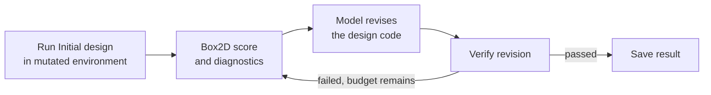
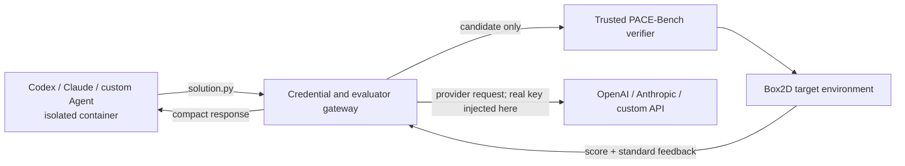

# PACE-Bench

**PACE-Bench: Benchmarking Physics Adaptation via Code Evolution in Dynamic Environments** evaluates whether a language-model agent can adapt an executable physical design after its environment changes.


## Why PACE-Bench?

Most physics benchmarks ask models to reason about or design for a fixed world. Real designs must also survive changes in friction, gravity, geometry, load, delay, or force limits. PACE-Bench tests this missing capability: infer what changed from simulator feedback, then revise the structure or controller until it works again.

## How it works

PACE-Bench contains 36 Box2D tasks across six physics domains. Each task has one `Initial` environment and four mutated stages. The provided Initial design passes `Initial` but fails each mutation, while a stage-specific reference confirms that every target remains solvable.

For an adaptation pair such as `Initial_to_Stage-1`, the benchmark runs the Initial design in the target environment as attempt 0, returns structured diagnostics, and asks the model to revise its Python design. Verification and revision repeat until success or budget exhaustion.



The repository ships one reproducible model baseline, **vanilla Previous-One + Best**. It also supports black-box evaluation of tool-using coding agents such as Codex and Claude Code. The sections below focus on installing the benchmark, reproducing its protocol, and evaluating your own model, method, or agent.

## Benchmark at a glance

| Property | Count |
| --- | ---: |
| Physics categories | 6 |
| Base tasks | 36 |
| Environments per task | 5 |
| Total task environments | 180 |
| Initial-to-mutated pairs | 144 |

The task suite spans statics, kinematics, dynamics, granular/fluid interaction, control, and exotic physics.


## Installation

Python 3.10 is the reference version. `requirements.txt` is the only dependency file and includes the benchmark, Box2D runtime, OpenAI-compatible client, and local Transformers stack.

The project is packaged so a published release can be installed directly with:

```bash
python -m pip install pace-bench
```

Until the first PyPI release is published, install the same package from the repository checkout using either Conda or uv below. A coding-agent evaluation additionally requires a running Docker Desktop or Docker Engine; Codex and Claude Code themselves are installed inside the isolated runtime image, not into the benchmark environment.

### Option A: Conda

```bash
git clone https://github.com/yuhao-zhan/PACE-Bench.git
cd PACE-Bench

conda create -n pace-bench python=3.10 -y
conda activate pace-bench
python -m pip install --upgrade pip
python -m pip install -r requirements.txt
```

### Option B: uv

Install [uv](https://docs.astral.sh/uv/), then run:

```bash
git clone https://github.com/yuhao-zhan/PACE-Bench.git
cd PACE-Bench

uv venv .venv --python 3.10
source .venv/bin/activate        # Windows: .venv\Scripts\activate
uv pip install -r requirements.txt
```

### Verify the installation

These commands use only the public benchmark interface:

```bash
pace-bench --help
pace-bench list --task S_01
pace-bench validate --task all --contracts-only

pace-bench evaluate \
  --task S_01 \
  --env Stage-1 \
  --method vanilla \
  --provider mock \
  --model mock \
  --attempts 1 \
  --output outputs/smoke \
  --no-resume
```

On a headless Linux worker, set:

```bash
export SDL_VIDEODRIVER=dummy
export SDL_AUDIODRIVER=dummy
export PYGAME_HIDE_SUPPORT_PROMPT=1
```

## Evaluate a model

### OpenAI or an OpenAI-compatible endpoint

```bash
export OPENAI_API_KEY=<your-key>

pace-bench evaluate \
  --task S_01 \
  --env Stage-1 \
  --method vanilla \
  --provider openai-compatible \
  --model <model-name> \
  --attempts 20 \
  --output outputs/my-run
```

For a compatible server, add `--base-url http://host:port/v1` or set `OPENAI_BASE_URL`.

### Local Hugging Face / Transformers model

```bash
pace-bench evaluate \
  --task K_03 \
  --env Stage-2 \
  --method vanilla \
  --provider local-transformers \
  --model /path/to/model \
  --device cuda:0 \
  --attempts 20
```

Use `--device mps` on supported Apple Silicon, `--device cpu` for CPU execution, or `--devices cuda:0,cuda:1 --workers 2` for deterministic per-device queues.

### Select tasks and environments

```bash
# One category, all four target stages
pace-bench evaluate --task category_3 --env all \
  --provider openai-compatible --model <model-name>

# Explicit task and environment selections
pace-bench evaluate --task S_01 --task K_01 \
  --env Stage-1 --env Stage-3 \
  --provider openai-compatible --model <model-name>

# Enumerate all 144 adaptation pairs without model calls
pace-bench evaluate --task all --env all \
  --provider mock --model mock --dry-run
```

Adaptation always uses Initial as the source. To generate a solution without a source reference, use from-scratch mode:

```bash
pace-bench evaluate --task D_01 --env Initial --from-scratch \
  --provider openai-compatible --model <model-name>
```

## Evaluate a coding agent as a black box

`pace-bench evaluate` measures a model through the fixed vanilla prompt loop. `pace-bench agent` measures a complete coding agent that may use shell tools, edit files, keep notes, and manage its own context and attempt history. The coding agent is therefore **not** forced to use Previous-One + Best. Both modes use the same task description, Initial reference, Box2D verifier, diagnostics, valid-submission budget, and result schema.

The benchmark package and all task/environment modules remain on the trusted host. The Agent container receives only:

```text
AGENT_PROMPT.md       default or evaluator-supplied instruction
TASK.md               exposed task context and attempt-0 feedback
initial_solution.py   solution that passed Initial
solution.py           agent's editable candidate
pace-submit           authenticated black-box submission client
```



The Agent container has a read-only root filesystem, a single writable workspace mount, no repository mount, no Docker socket, dropped Linux capabilities, resource limits, and an internal-only Docker network. Codex web search and Claude Code `WebSearch`/`WebFetch` are disabled. A separate gateway container is the only process with external access; it can reach the selected model API and the current evaluator session, but not arbitrary sites such as GitHub or PyPI. Real provider keys are mounted only into that gateway. The Agent sees a non-secret placeholder key.

### Prerequisites

1. Complete the normal PACE-Bench installation and verify `pace-bench --help`.
2. Install and start [Docker Desktop](https://docs.docker.com/desktop/) or Docker Engine.
3. Run `docker info` successfully as the same user.
4. Use a dedicated API key with a suitable spending limit. Account-login files such as `~/.codex/auth.json` or Claude subscription credentials are deliberately not mounted into the untrusted container.

The first Agent run builds `pace-bench-agent-runtime:0.2.0`. It currently pins Codex CLI `0.144.4` and Claude Code `2.1.211`; later runs reuse the image. Use `--rebuild-image`, `--codex-version`, or `--claude-version` to make an intentional version change and record that version with your results.

### Codex

Codex is run non-interactively with `codex exec --ephemeral`. The outer Docker container is the security boundary, so the inner Codex sandbox is bypassed to avoid nested Linux namespace failures. User configuration, project rules, MCP servers, and web search are not loaded. See OpenAI's [Codex non-interactive mode](https://learn.chatgpt.com/docs/non-interactive-mode) for the underlying CLI behavior.

Set the key only on the trusted evaluator host:

```bash
export CODEX_API_KEY=<dedicated-openai-api-key>

pace-bench agent \
  --task S_01 \
  --env Stage-1 \
  --agent codex \
  --model <codex-model> \
  --attempts 20 \
  --timeout-seconds 3600 \
  --output outputs/codex-s01
```

`OPENAI_API_KEY` is accepted as a fallback, but `CODEX_API_KEY` makes the single-purpose credential explicit. PACE-Bench configures a non-WebSocket Responses provider that points at its credential gateway; the real key is never placed in the Agent process environment.

### Claude Code

Claude Code is run in [non-interactive print mode](https://docs.anthropic.com/en/docs/claude-code/cli-usage) with a bounded number of agentic turns. Telemetry, error reporting, bug reporting, auto-updates, `WebSearch`, and `WebFetch` are disabled for the run.

```bash
export ANTHROPIC_API_KEY=<dedicated-anthropic-api-key>

pace-bench agent \
  --task K_03 \
  --env Stage-2 \
  --agent claude \
  --model <claude-model-or-alias> \
  --attempts 20 \
  --max-turns 200 \
  --timeout-seconds 3600 \
  --output outputs/claude-k03
```

PACE-Bench sets `ANTHROPIC_BASE_URL` to the internal credential gateway. This follows Claude Code's documented [gateway and proxy configuration](https://docs.anthropic.com/en/docs/claude-code/llm-gateway) while keeping the actual `ANTHROPIC_API_KEY` outside the Agent container.

### Your own Agent

A custom Agent may use the built-in runtime image or a user-built image. Its only runtime contract is:

- run from `/workspace`;
- read `$PACE_AGENT_PROMPT_FILE` and `$PACE_AGENT_TASK_FILE`;
- write candidates to `solution.py`;
- call `$PACE_AGENT_SUBMIT solution.py` after each revision;
- stop when the response reports success or no remaining budget;
- include Python 3 in a custom image because `pace-submit` is a Python client.

For an Agent already installed in an image:

```bash
docker build -t my-physics-agent:latest path/to/my-agent

pace-bench agent \
  --task D_01 \
  --env Stage-3 \
  --agent custom \
  --image my-physics-agent:latest \
  --agent-command "my-agent --prompt {prompt_file}" \
  --model my-agent-model \
  --attempts 20 \
  --output outputs/my-agent
```

`--agent-command` is parsed as an argument vector rather than executed by a host shell. It supports `{prompt_file}`, `{task_file}`, and `{workspace}` placeholders. The container also receives:

```text
PACE_AGENT_PROMPT_FILE=/workspace/AGENT_PROMPT.md
PACE_AGENT_TASK_FILE=/workspace/TASK.md
PACE_AGENT_SUBMIT=/workspace/pace-submit
```

If the custom Agent uses a local model already inside its image, no further network option is needed. If it calls a hosted API, route that one endpoint through the credential gateway:

```bash
export MY_AGENT_API_KEY=<dedicated-key>

pace-bench agent \
  --task F_02 --env Stage-4 \
  --agent custom \
  --image my-physics-agent:latest \
  --agent-command "my-agent --task {prompt_file}" \
  --custom-base-url https://models.example.org/v1 \
  --custom-api-key-env MY_AGENT_API_KEY
```

Inside the container, the custom Agent uses `PACE_AGENT_API_BASE` and the placeholder `PACE_AGENT_API_KEY`. The gateway replaces that placeholder with the trusted-host value before forwarding the request. The configured upstream is fixed by the evaluator; the Agent cannot choose another network destination.

### Submission protocol and prompts

The default instruction tells the Agent to inspect `TASK.md`, revise `solution.py`, submit, read `last_feedback.md`, and continue autonomously. Supply a different initial instruction without changing benchmark feedback or scoring:

```bash
pace-bench agent --task C_01 --env Stage-1 --agent codex \
  --prompt-file my_agent_prompt.md
```

Within a session:

```bash
./pace-submit --status        # does not consume the budget
./pace-submit solution.py     # verifies one candidate
```

Missing `build_agent`, unusably short code, malformed JSON, or an oversized request is rejected without consuming the valid-submission budget. Syntax, construction, runtime, constraint, and physics failures from structurally valid code are normal consumed attempts. Every accepted submission stores the full candidate, score, metrics, feedback, error, timing, and artifacts server-side. Only compact score/feedback data is returned to the Agent, avoiding the very large raw-metrics payload in its context.

Each session writes the normal schema-versioned result plus an auditable workspace and `agent.log` under the output tree. A clean Agent exit before success or exhaustion is recorded as `agent_exited`; timeout and process failures are recorded separately. Run one task/environment per Agent invocation so every container starts with an independent context. A shell loop can enumerate a larger evaluation:

```bash
for task in S_01 S_02 S_03 S_04 S_05 S_06; do
  for env in Stage-1 Stage-2 Stage-3 Stage-4; do
    pace-bench agent --task "$task" --env "$env" --agent codex \
      --model <codex-model> --attempts 20 --output outputs/codex-statics
  done
done
```

Existing Agent results are not overwritten silently. Use `--run-index 2` for another independent run, or pass `--overwrite` when replacing a known test run intentionally.

### Security boundary

The container and gateway prevent ordinary Agent tools from reading the installed task package or downloading the public repository. Candidate Python additionally permits only the benchmark's documented primitives plus the `math`, `random`, and `Box2D` imports required by existing references; file/process/network access, dynamic execution, and Python dunder introspection are rejected before execution.

This is a benchmark isolation boundary, not a general multi-tenant code-execution service. Run the trusted evaluator on a dedicated machine without unrelated secrets, keep Docker patched, use dedicated short-lived API keys, inspect `agent.log`, and do not expose the evaluator port publicly. The session HTTP service uses a random bearer token and is intended to be reachable only through the per-run internal gateway.

## Bring your own model or method

Research code can live outside this repository. Both extension points accept `package.module:Class` dotted imports. A minimal example is installed from [`src/custom_extension.py`](src/custom_extension.py):

```bash
pace-bench evaluate \
  --task S_01 --env Stage-1 \
  --provider custom_extension:CustomModel \
  --model my-model \
  --method custom_extension:CustomMethod \
  --attempts 2
```

A model provider implements:

```text
generate(GenerationRequest) -> GenerationResult
close()
```

A method implements:

```text
initialize(context)
build_initial_request()
build_revision_request(history)
observe(attempt)
finalize(result)
```

PACE-Bench retains ownership of task selection, attempt accounting, solver retries, Box2D verification, result serialization, and environment-pair identity.

## Validation and results

```bash
# List tasks and their environments
pace-bench list

# Validate module contracts and imports
pace-bench validate --task all --contracts-only

# Validate all reference-solution expectations for one task
pace-bench validate --task S_01

# Full 36-task reference validation; this is intentionally slow
pace-bench validate --task all

# Aggregate completed evaluation JSON
pace-bench report --input outputs/my-run
```

Results are stored under:

```text
outputs/<run>/<category>/<task>/<model>/<method>/run-<N>/Initial_to_Stage-<K>.json
```

Schema version `1.0` records task/pair identity, configuration, seeds, every request and candidate, task metrics, feedback, scores, errors, token usage, timing, and artifact paths. Completed results are resumed by default; pass `--no-resume` to rerun them.

For comparable reporting, keep the canonical task step limits and record the model revision, hardware, seed, attempt budget, number of runs, temperature, maximum tokens, and headless/display setting.

## Repository layout

```text
PACE-Bench/
├── src/
│   ├── custom_extension.py       # external model/method example
│   └── pace_bench/
│       ├── cli.py                # list, evaluate, validate, report
│       ├── agent.py              # black-box session, submission API, workspace
│       ├── agent_container.py    # Docker isolation and agent adapters
│       ├── agent_gateway.py      # credential-injecting allowlist gateway
│       ├── evaluation/           # vanilla loop, prompts, providers, verifier, results
│       ├── tasks/
│       │   ├── registry.py       # task/env discovery and selection
│       │   ├── categories/       # 36 benchmark tasks
│       │   └── demos/            # 3 non-benchmark demos
│       ├── simulator.py
│       ├── renderer.py
│       └── primitives.py
├── assets/
├── requirements.txt
└── pyproject.toml                # minimal package and CLI installation metadata
```

Most source files belong to the benchmark tasks themselves. Each task intentionally keeps local modules for its design, environment, evaluator, diagnostics, prompt, renderer, and mutation stages; these encode task-specific physics rather than duplicated framework functionality.

## Scope and responsible use

PACE-Bench currently models 2D rigid-body systems in Box2D. It does not cover 3D dynamics, deformable bodies, full fluid simulation, perception, navigation, or multi-agent coordination. Task prompts and diagnostics are English-only.

Generated Python is executed by the benchmark verifier under strict static and runtime namespace restrictions. For coding agents, the repository additionally provides the isolated container and credential-gateway path above. The evaluator should still run on a dedicated host without unrelated credentials; PACE-Bench is not designed as a public multi-tenant execution service.

Contributions should preserve task physics, reference behavior, prompt exposure rules, deterministic seeds, simulation timing, attempt budgets, and canonical environment-pair identities. Experimental methods should remain in external packages rather than being added to the benchmark runtime.

PACE-Bench is released under the [MIT License](LICENSE).
